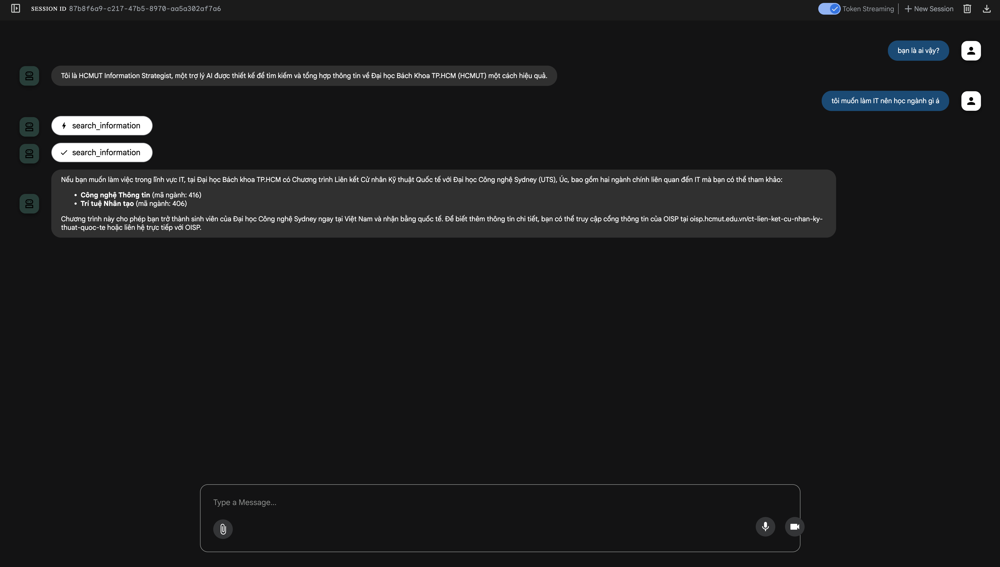

# Agentic HCMUT University Admission chatbot

Hi 👋 Welcome to the official repository for our **Agentic HCMUT University Admission Chatbot**!  

This project aims to build an intelligent, agentic chatbot to assist prospective students with information about Ho Chi Minh City University of Technology (HCMUT). The chatbot can answer questions regarding admission requirements, academic programs, campus facilities, application procedures, scholarships, and other university-related inquiries. By leveraging advanced NLP and RAG (Retrieval-Augmented Generation) technologies, our system provides accurate and helpful responses based on the university's official documentation and data.

**Features** ✨
- **Accurate Information Retrieval**: Answers questions using verified university data and documents
- **Vietnamese Language Support**: Optimized for both Vietnamese and English queries
- **Context-Aware Responses**: Maintains conversation context for more natural interactions
- **Semantic Search**: Uses advanced embedding techniques to understand question intent
- **Agentic Capabilities**: Can reason through complex multi-step questions about admissions
- **Flexible Model Configuration**: Support both local hosted models and cloud APIs (OpenAI)
- **Advanced Reranking**: Optional reranking capability for improved retrieval accuracy

The system architecture is implemented based on paper [URAG: Implementing a Unified Hybrid RAG for Precise Answers in University Admission Chatbots – A Case Study at HCMUT](https://arxiv.org/pdf/2501.16276)

---

## Quick setup 🚀

The following steps will help you to get the system up and running:

### 1. Environment Setup

- Create an `.env` file from template (adjust settings accordingly):
    ```bash
    make setup-env
    ```

### 2. Vector Database Setup

- Setup Milvus Cloud for vector database:
    1. Visit [https://zilliz.com/cloud](https://zilliz.com/cloud) and create an account
    2. Create a new cluster
    3. Copy the cluster endpoint and token
    4. Fill the following variables in your `.env` file:
        - `MILVUS_CLOUD_URI`: Your cluster endpoint
        - `MILVUS_CLOUD_TOKEN`: Your cluster token

### 3. Model Configuration

The system supports flexible model configuration through `chatbot/config/models_config.json`. You can choose between local hosted models or cloud APIs:

#### Embedding Models Configuration

**Option 1: Local Hosted Embedder (Recommended)**
```json
{
    "Embedding": {
        "model_id": "",
        "provider": "local",
        "base_url": "http://embedder-server:8020"
    }
}
```

If you're using an external hosted embedder (wrapped with external URL):
```json
{
    "Embedding": {
        "model_id": "",
        "provider": "local",
        "base_url": "https://your-external-domain.com"
    }
}
```

**Option 2: OpenAI Embeddings**
```json
{
    "Embedding": {
        "model_id": "text-embedding-3-small",
        "provider": "openai",
        "base_url": ""
    }
}
```

For OpenAI configuration, make sure to add your API key to `.env`:
```bash
OPENAI_API_KEY=your_openai_api_key_here
```

#### Reranker Configuration

The system comes pre-configured with a Vietnamese reranker for enhanced accuracy:

**Local Hosted Reranker (Default)**
```json
{
    "Reranker": {
        "base_url": "http://reranker-server:8030",
        "rerank_endpoint": "/v1/reranking"
    }
}
```

If you're using an external hosted reranker:
```json
{
    "Reranker": {
        "base_url": "https://your-external-domain.com",
        "rerank_endpoint": "/v1/reranking"
    }
}
```

**🔧 Hardware Limitations:** If you don't have sufficient hardware to host the reranker, you can disable it by commenting out the reranker initialization in both retrieval servers:

1. In `chatbot/server/faq_server/server_app.py`:
```python
# Comment out these lines to disable reranker
# reranker = VLLMReranker(
#     config=VLLMRerankerConfig(
#         base_url=reranker_config.base_url,
#         rerank_endpoint=reranker_config.rerank_endpoint
#     )
# )

# And pass None instead:
retriever = FAQRetriever(
    collection_name=SETTINGS.MILVUS_COLLECTION_FAQ_NAME,
    embedder=embedder,
    bm25_client=bm25_client,
    vector_db=vector_db,
    reranker=None  # Disable reranker
)
```

2. In `chatbot/server/document_server/server_app.py`:
```python
# Apply the same changes for document retriever
retriever = DocumentRetriever(
    collection_name=SETTINGS.MILVUS_COLLECTION_DOCUMENT_NAME,
    embedder=embedder,
    bm25_client=bm25_client,
    vector_db=vector_db,
    reranker=None  # Disable reranker
)
```

**Note:** Disabling the reranker will make the system use hybrid search only (semantic + keyword matching), which still provides good results but with potentially lower accuracy compared to the full pipeline with reranking.

### 4. Network Setup

Create network for the whole system. This will create network `chatbot` and add to `.env` file with the corresponding value of the network subnet:
```bash
make create-network
```

### 5. Model Services Setup (For Local Hosting)

If you choose to use local hosted models, you need to setup the model services **after** creating the network and **before** building the chatbot server:

#### Option A: Setup Both Embedder and Reranker
```bash
make up-model
```

#### Option B: Setup Only Reranker (if using OpenAI embeddings)
```bash
make up-reranker
```

**Note:** These commands will build and start the model serving containers. The first run may take several minutes to download models and initialize services.

### 6. Chatbot Service Setup

Build and start the chatbot server:
```bash
make up-build-chatbot
```

### 7. Data Upload

Upload data to the system by accessing [http://localhost:8003/docs](http://localhost:8003/docs):
- Upload FAQ data in CSV format
- Upload document data in TXT format
- Or you can upload data from web URLs directly

### 8. Access the Chatbot

Access the chatbot interface at [http://localhost:8010](http://localhost:8010):



---

## Architecture Overview 🏗️

The system uses a multi-component architecture:

- **Embedding Service**: Converts text to vector representations (local or OpenAI)
- **Reranker Service**: Reorders search results for better relevance (optional)
- **Vector Database**: Stores and searches document embeddings (Milvus Cloud)
- **BM25 Search**: Provides keyword-based search capabilities
- **Hybrid Retrieval**: Combines semantic and keyword search results
- **LLM Services**: Generates final responses using retrieved context

## Performance Notes 📊

- **With Reranker**: Higher accuracy, requires more computational resources
- **Without Reranker**: Good accuracy with hybrid search, lower resource requirements
- **Local Embedder**: Faster response times, no API costs, requires local hosting
- **OpenAI Embedder**: No local hosting required, API costs apply

## Setup Scenarios 🔧

### Scenario 1: Full Local Setup (Recommended for Production)
- Use local embedder and reranker
- Run `make up-model` after network setup
- Best performance and accuracy

### Scenario 2: Hybrid Setup (Cost-Effective)
- Use OpenAI embeddings + local reranker
- Run `make up-reranker` after network setup
- Good balance of cost and performance

### Scenario 3: Cloud-Only Setup (Minimal Infrastructure)
- Use OpenAI embeddings only
- Disable reranker in server configs
- Lowest infrastructure requirements

---

We hope you enjoy exploring our project! If you have questions, feel free to open an issue or contribute to this repository. 😊